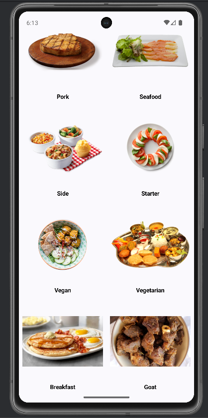
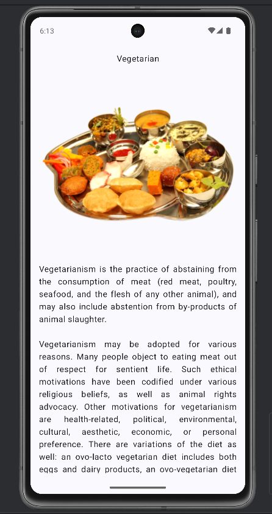

# 🍽️ Recipe App

A modern Android application built with **Kotlin** and **Jetpack Compose** that allows users to explore different recipe categories. The app fetches data from TheMealDB API and displays them in a clean, responsive Material Design UI.

## 📱 Screenshots

<div align="center">
  
  &nbsp;&nbsp;&nbsp;
  
</div>

## ✨ Features

- **🎨 Modern UI** - Built with Jetpack Compose and Material 3 design
- **🧭 Smooth Navigation** - Seamless navigation between recipe categories and details
- **📱 Responsive Design** - Optimized for different screen sizes and orientations
- **🌐 API Integration** - Fetches real-time data from TheMealDB API
- **⚡ Fast Loading** - Efficient image loading and caching with Coil
- **🔄 State Management** - Proper loading and error state handling
- **📜 Scrollable Content** - Smooth scrolling for detailed recipe descriptions
- **🏗️ Clean Architecture** - MVVM pattern for maintainable and testable code

## 🏗️ Architecture & Tech Stack

### Architecture Pattern
- **MVVM (Model-View-ViewModel)** - Separation of concerns and reactive UI updates

### Technologies Used
- **Language:** Kotlin
- **UI Framework:** Jetpack Compose
- **Design System:** Material 3
- **Navigation:** Jetpack Navigation Compose
- **Networking:** Retrofit 2 + Gson
- **Async Operations:** Kotlin Coroutines
- **Image Loading:** Coil
- **Dependency Injection:** (Ready for Hilt/Dagger integration)

### API
- **TheMealDB API** - Free meal database API for recipe categories and details

## 📂 Project Structure

```
app/
├── src/main/java/com/yourpackage/recipeapp/
│   ├── MainActivity.kt              # App entry point
│   ├── RecipeApp.kt                 # Navigation setup
│   ├── Screen.kt                    # Navigation routes definition
│   ├── viewmodel/
│   │   └── MainViewModel.kt         # Business logic and state management
│   ├── network/
│   │   └── ApiServices.kt           # Retrofit API interface
│   ├── model/
│   │   └── Category.kt              # Data models
│   ├── ui/
│   │   ├── screens/
│   │   │   ├── RecipeScreen.kt      # Recipe categories grid
│   │   │   └── CategoryDetailScreen.kt # Recipe detail view
│   │   └── theme/                   # App theming
│   └── utils/                       # Utility classes
└── res/                            # Resources (layouts, strings, etc.)
```

## 🚀 Getting Started

### Prerequisites
- Android Studio Arctic Fox or later
- Minimum SDK: API 24 (Android 7.0)
- Target SDK: API 34 (Android 14)
- Kotlin 1.8+

### Installation

1. **Clone the repository**
   ```bash
   git clone https://github.com/yourusername/recipe-app.git
   cd recipe-app
   ```

2. **Open in Android Studio**
   - Launch Android Studio
   - Choose "Open an Existing Project"
   - Navigate to the cloned repository folder
   - Wait for Gradle sync to complete

3. **Build and Run**
   - Connect an Android device or start an emulator
   - Click the "Run" button or press `Shift + F10`

### Configuration

No additional configuration is required. The app uses the free TheMealDB API which doesn't require an API key.

## 🔧 Key Components

### MainViewModel
Handles all business logic including:
- API data fetching
- State management (Loading, Success, Error)
- Recipe category data processing

### RecipeScreen
- Displays recipe categories in a responsive grid layout
- Implements pull-to-refresh functionality
- Handles loading and error states

### CategoryDetailScreen
- Shows detailed information about selected recipe category
- Implements smooth scrolling for long descriptions
- Optimized image loading and display

### Navigation
- Type-safe navigation between screens
- Proper state preservation during navigation
- Back navigation handling

## 📱 App Flow

1. **Launch** → App loads and fetches recipe categories from API
2. **Browse** → User sees grid of recipe categories with images
3. **Select** → Tap on any category to view detailed information
4. **Detail** → View category name, image, and detailed description
5. **Navigate** → Use back button to return to categories list

## 🎨 Design Features

- **Material 3 Design System** - Latest Material Design guidelines
- **Dark Mode Support** - Automatic theme switching based on system settings
- **Adaptive Layouts** - Responsive design for phones and tablets
- **Smooth Animations** - Fluid transitions between screens
- **Loading States** - Professional loading indicators and error handling

## 🔄 State Management

The app implements proper state management with:
- Loading states during API calls
- Error handling with retry mechanisms
- Success states with data display
- Empty states for better user experience

## 🌐 Network Layer

- **Retrofit** for HTTP client
- **Gson** for JSON parsing
- **Coroutines** for asynchronous operations
- **Error handling** for network failures
- **Caching** strategy for improved performance

## 🧪 Testing (Future Enhancement)

Ready for implementation:
- Unit tests for ViewModels
- UI tests for Compose screens
- Integration tests for API calls
- Mock data for testing scenarios

## 🚀 Future Enhancements

- [ ] **Recipe Search** - Add search functionality across all recipes
- [ ] **Favorites** - Allow users to save favorite recipe categories
- [ ] **Detailed Recipes** - Show individual recipes within categories
- [ ] **Offline Support** - Cache data for offline viewing
- [ ] **User Profiles** - Personal recipe collections
- [ ] **Recipe Sharing** - Share recipes with friends
- [ ] **Nutrition Info** - Display nutritional information
- [ ] **Shopping Lists** - Generate shopping lists from recipes


## 🙏 Acknowledgments

- [TheMealDB](https://www.themealdb.com/) for providing the free recipe API
- [Jetpack Compose](https://developer.android.com/jetpack/compose) team for the amazing UI toolkit
- [Material Design](https://material.io/) for design guidelines
- Android development community for continuous inspiration

## 📊 Project Stats


---

⭐ **Star this repository if you found it helpful!**

Made with ❤️ and ☕ by ABHINAV SHUKLA
